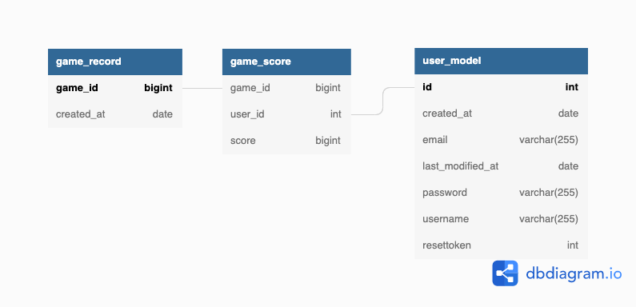

# Ceng453_TermProject_Group8_backend
Ceng453 Monopoly game backend

Documentation can be found at docs/javadoc folder as javadoc

Swagger api documentation can be found at
https://ceng453-term-project-group8.herokuapp.com/swagger-ui/index.html

Our backend requires http basic authentification even for swagger. For development purposes a default username and password is set
username: swagger
password: swagger

Database Diagram:

